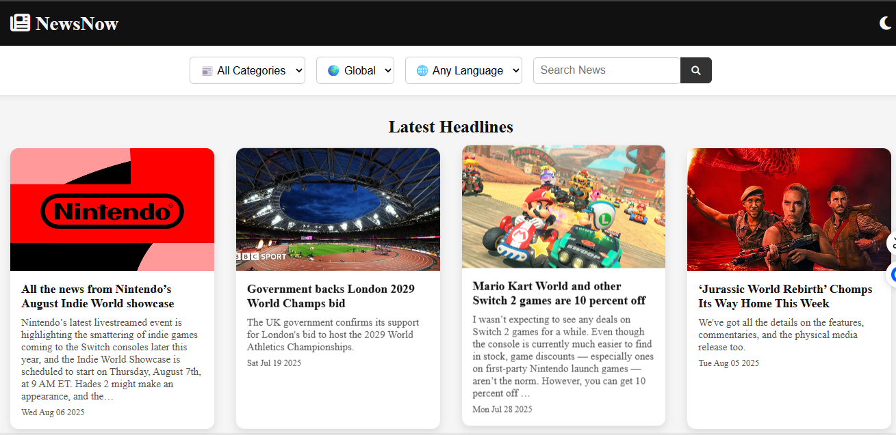

# 📰 NewsNow

## 📌 Description
**NewsNow** is a fully responsive and modern web application built with **NewsAPI.org** to deliver **real-time global news headlines**.  
Users can browse trending stories, search by keywords, and filter articles by **category, country, and language** — all within a sleek, mobile-friendly interface.

---

## 🚀 Features
- 🔎 **Search Functionality** – Find relevant news by entering keywords  
- 🗂️ **Category Filtering** – Explore topics like Business, Health, Technology, Sports, and more  
- 🌍 **Country Selection** – Filter news by regions (USA, UK, India, etc.) with flag icons  
- 🌐 **Language Support** – View news in multiple languages (English, French, Spanish, etc.)  
- 🌓 **Dark Mode** – Toggle between light and dark themes for a better reading experience  
- 🔁 **Pagination / Infinite Scroll** – Load more articles seamlessly  
- 📰 **Card-Based Layout** – Responsive cards with images, headlines, summaries & publish dates  
- ⏳ **Loader Animation** – Beautiful spinner while fetching articles from the API  

---

## 🌐 Live Demo
🔗 **[Try NewsNow Live](https://gerund.netlify.app/)**

---

## 📸 Screenshot

---

## 🛠 Tech Stack
- **HTML5** – Structure  
- **CSS3 (Flexbox & Grid)** – Responsive styling and layouts  
- **JavaScript (Vanilla)** – Dynamic rendering and API calls  
- **NewsAPI.org** – Real-time news headlines provider  
- **FontAwesome / Icons** – For category & theme toggle icons  

---

## 📂 Project Structure
NewsNow/ 
│ 
├── index.html # Main HTML page 
├── styles.css # CSS styles (light/dark mode, responsive design) 
├── script.js # JavaScript logic for API fetching, filters, and rendering 
├── newsapi.png # Screenshot for README 
├── assets/ # Optional folder for icons/images 
└── README.md # Project documentation
