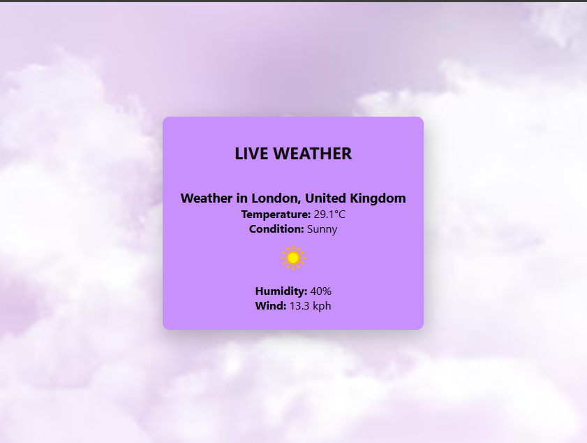

# 🌦 Mini Weather API

## 📌 Description
A lightweight and beginner-friendly **Live Weather App** that fetches real-time weather data for any city using the **OpenWeatherMap API**.  
It’s built with **HTML, CSS, and JavaScript** — no frameworks, just pure web magic.

### 🔍 Features
- **Real-time Weather Fetching** – Retrieves live weather details including:
  - 🌡 **Temperature**
  - ⛅ **Condition** (e.g., sunny, cloudy)
  - 💧 **Humidity**
  - 🌬 **Wind Speed**
- **Beginner-Friendly** – Perfect for learning APIs, JSON parsing, and DOM updates.
- **Error Handling** – Displays clear messages for invalid cities or API errors.
- **Lightweight & Fast** – Runs directly in your browser without any installation.
- **Responsive Design** – Works on desktop, tablet, and mobile screens.

---

## 🌐 Live Demo
🔗 **[View Live Here](https://weatherlivecast.netlify.app/)**

---

## 📸 Screenshot

---

## 🛠 Tech Stack
- **HTML5** – Structure
- **CSS3** – Styling & responsive layout
- **JavaScript (Vanilla)** – API fetching & dynamic updates
- **OpenWeatherMap API** – Real-time weather data source

---

## 📂 Project Structure
Mini-Weather-API/
│
├── index.html # Main HTML file – contains structure and form elements 
├── styles.css # CSS styling – layout, background, colors, responsiveness 
├── script.js # JavaScript – handles API calls, DOM updates, and error handling 
├── weather.jpg # Background image for the app 
├── README.md # Project documentation 
└── assets/ 
└── screenshot.png # Screenshot of the application (for README display)
